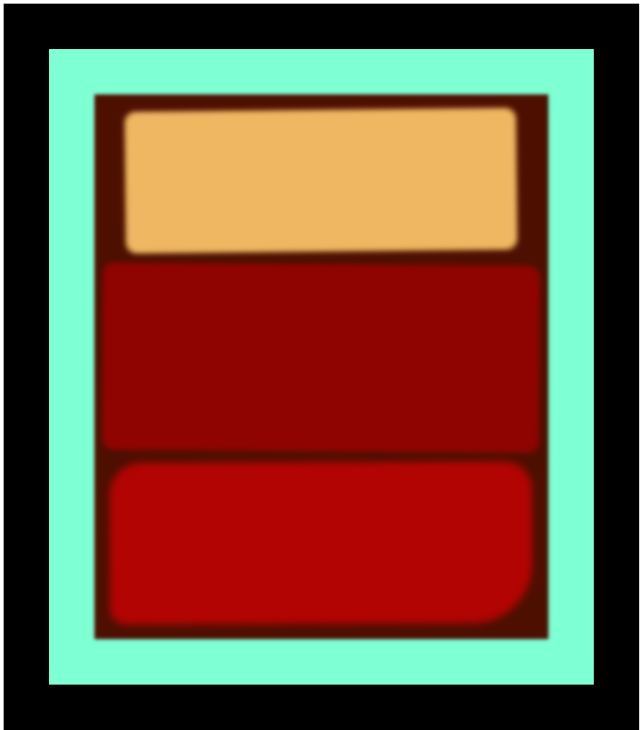

# 🎨 Rothko Painting with HTML & CSS

This project recreates a **Mark Rothko-style abstract painting** using only HTML and CSS — no images, no JavaScript.

## 📂 Project Structure
```
/project-directory
└── images/
    └── preview.png  # Screenshot of the final output```
├── index.html       # Main HTML file with painting structure
├── README.md       # Readme
├── styles.css       # CSS for layout and paint effects
```
## 🖼️ Description

The painting is composed of a bordered `.frame` that contains a `.canvas`, which holds three abstract color fields (`.one`, `.two`, and `.three`). These rectangles simulate Rothko’s signature blurred, emotional, and color-rich artworks.

### 🔧 Techniques Used

- **HTML** semantic structure
- **CSS transforms** for slight rotations
- **Box shadows** to simulate color bleeding
- **Filter blur** to create Rothko's soft, layered texture
- **Border radius** for organic feel
- **Pure CSS styling** — no external images or JS

## 📸 Preview

Here’s a screenshot of the final result:



## 🚀 How to Use

1. Clone the repo:

   ```git clone https://github.com/your-username/rothko_painting.git```<br>
   ```cd rothko_painting```

2. Open `index.html` in your browser to view the painting.

No build tools or dependencies needed — just open and enjoy.

## ✅ License

This project is open-source and free to use. Attribution is appreciated but not required.

---

Created with ❤️ using pure HTML and CSS.
pgsql
Copy
Edit

### ✅ How to Use

- Copy this into your `README.md` file as-is.
- GitHub or any markdown viewer will render it as a **code block**, not as formatted headings and sections.
- If you want it to look **visually like a code box** but still keep headings and formatting, you’d need to style it differently using HTML/CSS — not markdown.


